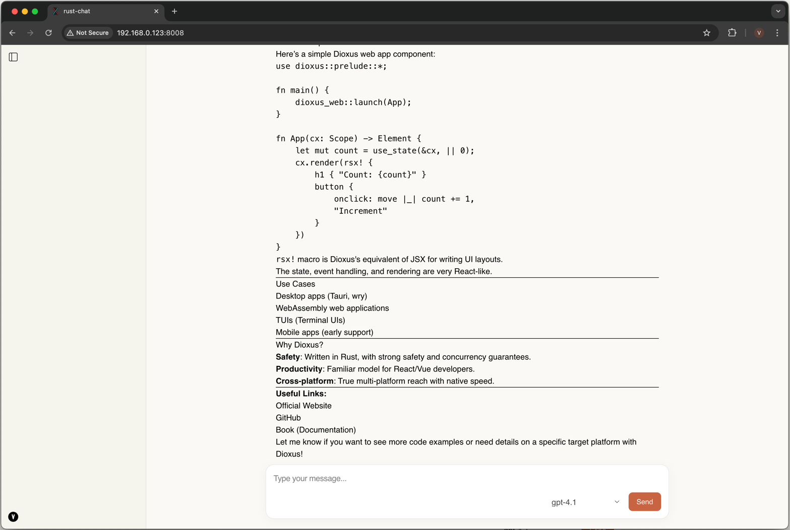

# Development (linux, macOS)

Warning: current build has hardcoded Chat Endpoint, thus, it would be accessible to you only if you are connected to my VPN network\
[Issue](https://github.com/valaises/rust-chat/issues/5)

1. Install [Rust](https://www.rust-lang.org/tools/install)
```sh
curl --proto '=https' --tlsv1.2 -sSf https://sh.rustup.rs | s
```

2. Install toolchain and WASM32 for web development
```sh
rustup toolchain install stable
rustup target add wasm32-unknown-unknown
```

3. Install cargo binstall
```sh
cargo install cargo-binstall
```

4. Install [Dioxus](https://dioxuslabs.com/)
```sh
cargo binstall dioxus-cli
```

5. Clone rust-chat
```sh
git clone https://github.com/valaises/rust-chat.git
cd rust-chat
```

6. Serve project for web
```bash
dx serve --platform web --package core --port 8008 --open
```

After project is compiled and launched http://localhost:8008 should open in your browser automatically
